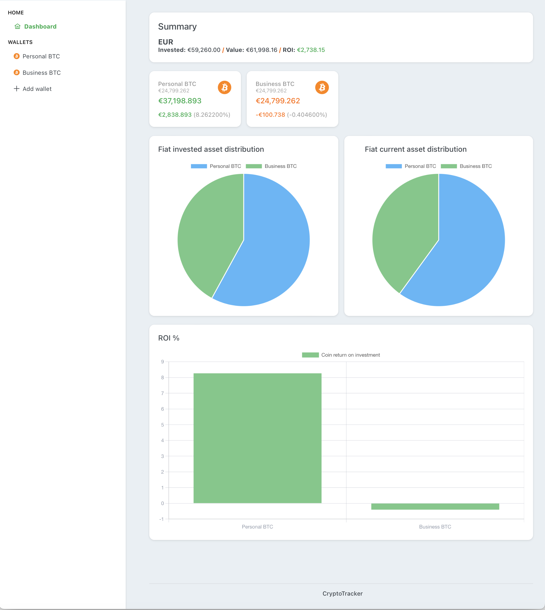
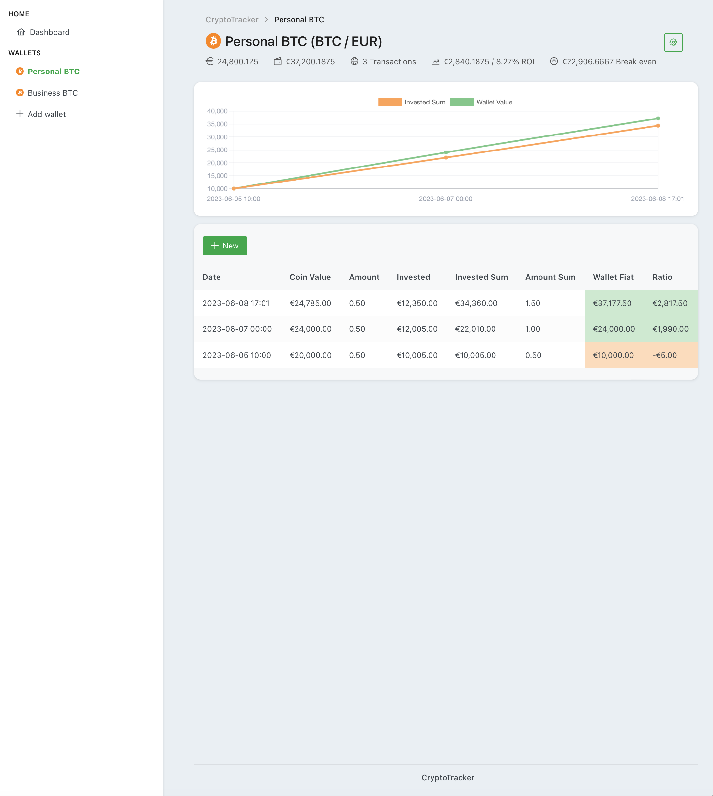
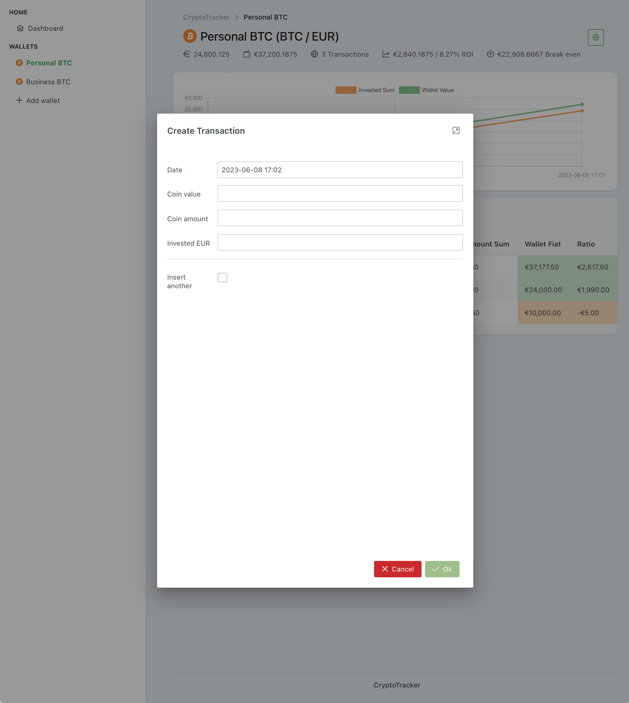

# Crypto Tracker

Crypto Tracker allows you to track your crypto portfolio through a **local** web app.

The web app is self contained in a binary file, you just need to execute it and your browser
will pop up with the application ready for you to use.

All the transactions get stored in an XML file, this provides an easy way to import data to other applications or your own scripts.

If you run the executable with no provided flags it will open with the defaults.

```
Run the Crypto Tracker web app

Usage:
  cryptotracker run [flags]

Flags:
  -f, --file string    Transaction file to use (default "cryptotracker.xml")
  -h, --help           help for run
  -i, --host string    Host to serve the app (default "127.0.0.1")
  -b, --open-browser   Open your web browser (default true)
  -p, --port int       Port to use (default 40042)
```

## Screenshots




